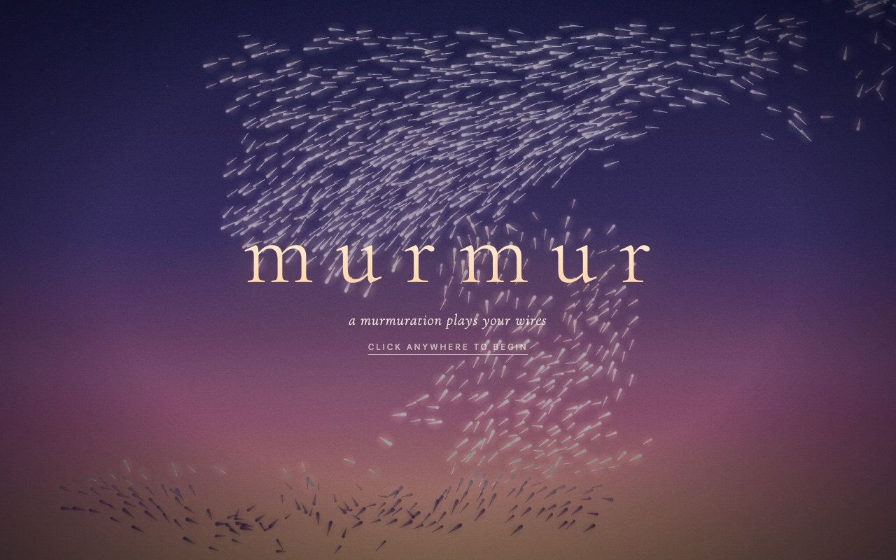
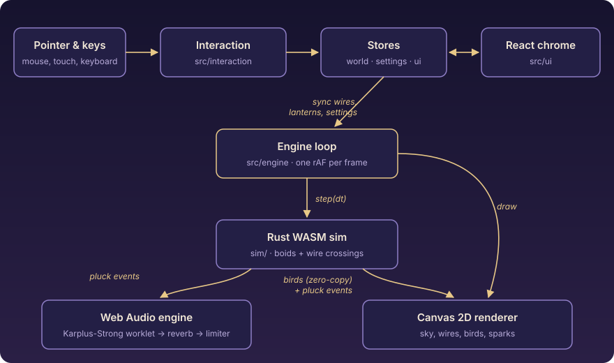
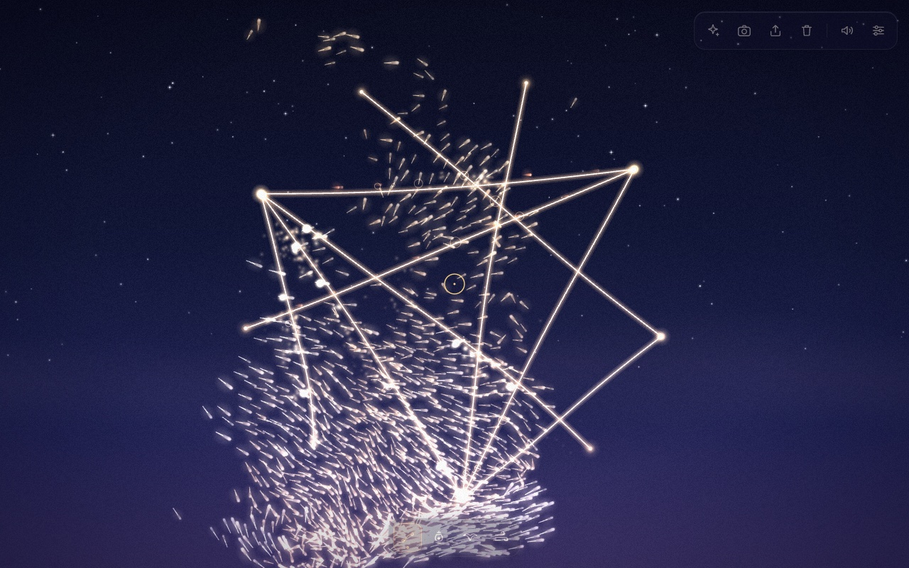

Murmur is a small instrument you play by drawing wires across a twilight sky and letting a flock of starlings do the rest. You can [try it here](https://murmur.mattoconn.workers.dev); it runs on desktop and on an iPhone, and audio starts on your first tap. What follows is how it came to be and how it works.

## Where it started

I wanted a one-shot creative project, the kind you might finish over a weekend, that was highly visual and interactive. Most of my hobby work is systems code, so I was after something with an immediate, playful surface.

The image that stuck was a starling murmuration at dusk, a huge cloud of birds folding and streaming over a row of power lines. Then a second thought landed on top of it: what if the birds plucked those wires like a harp? The music would not be composed. It would emerge from two things, the flocking and the geometry you draw. Change either and you get a different piece, so every session sounds different.

## How to play

Drag anywhere to string a wire. Its length sets the pitch, quantized to a scale so the result stays musical. Whenever a bird crosses a wire, the wire is plucked: it vibrates, flashes, throws a few sparks, and sounds a note.

There are a few other tools for shaping the flock. Lanterns attract it. A hawk scatters it in panic waves. A gust pushes a wind impulse through it. A Compose button generates whole layouts for you (harp, constellation, loom, cascade, ring), and you can share what you made as a link.

*The title screen. It exists for a practical reason I will get to below.*

## Why the web

I like things that need nothing installed. A link that works on a laptop and on a phone is the lowest-friction way to share an instrument. It also keeps the deployment simple: Murmur is a static site with no backend.

The split of languages follows the workload. The hot path, the flock simulation, is Rust compiled to WebAssembly. Everything else, including audio, rendering, interaction and the interface, is TypeScript, with React for the chrome around the canvas.

*The whole thing on one page. One engine loop per animation frame ties the modules together.*

## The simulation in Rust and WebAssembly

The flock is a boids simulation: each bird steers by separation, alignment and cohesion. To keep neighbor lookups cheap I use a spatial hash grid, and each bird considers at most about eight neighbors. Real starlings track a fixed number of neighbors rather than everything within a radius.

Two choices matter more than the textbook rules. First, the edges of the screen use soft steering instead of wraparound. Wrapping would let birds teleport across a wire and fake a crossing, and it would split the flock in half. Second, a slowly drifting roost point gives the cloud somewhere to go, so it streams and banks instead of milling in place.

Wire crossings come from geometry: for every bird I test its path from the previous position to the current one against each wire. Birds also have a perching state machine, so some land on a wire, sit for a while, and take off.

I skipped wasm-bindgen. The module exposes about twenty raw `extern "C"` functions taking numeric arguments, compiles to roughly 95 KB, and has zero imports. State lives in a `thread_local`, so there is no `unsafe`. At startup the TypeScript side checks an ABI version and a stride, and refuses to run on a mismatch.

Data crosses the boundary without copying. TypeScript reads `Float32Array` views directly over WASM memory, four floats per bird, and rebuilds the views if the memory ever grows. Pluck events are coalesced per wire and kind into a fixed-size buffer, so it cannot overflow however dense the flock gets.

A step for 2000 birds takes about 0.7 ms. The step allocates nothing, which I verify in tests with a counting allocator.

## One event stream

There is exactly one source of plucks: the simulation. Each frame, its batch of events goes to the audio engine and the renderer together. Because both consume the same list, the flash, the sparks and the sound always coincide. There is no second detector to drift out of sync.

## The sound

Each note is Karplus-Strong plucked-string synthesis. The idea is simple: fill a short delay line with a burst of noise, then loop it back through a lowpass filter. Each pass through the loop smooths and quiets the signal, so it rings and decays like a string, and the length of the loop sets the pitch.

This runs in an AudioWorklet on the audio thread. Rather than creating a node per note, one worklet node hosts a pool of 24 voices. When the pool is full, the oldest voice is stolen with a short crossfade to avoid clicks.

Pitch comes from the logarithm of the wire's length relative to the screen diagonal, so doubling a wire's length drops the pitch an octave, exactly as with a real string. That value is quantized to the chosen scale across about two and a half octaves.

A dense flock could easily machine-gun a single wire, so each wire has a 90 ms cooldown and there is a cap on notes per frame. The effect is that a busy crossing turns into an arpeggio. The output goes through a generated reverb impulse, a compressor and a limiter.

iOS taught me two lessons. Audio must start from a user gesture, which is why there is a title screen at all. And the audio context has to be resumed after interruptions such as a phone call or a screen lock, or the instrument goes quietly dead.

## Rendering

I used Canvas 2D instead of WebGL. It was fast enough, about 2 ms of render time for 2000 birds, and far simpler. The tricks are the usual ones done carefully: pre-rendered glow sprites so each bird is one `drawImage`, batched tails, no `shadowBlur`, no per-frame allocation, and a quality governor that backs off when a device struggles.

The visual trick I am proudest of I call ember and ink. Additive glowing birds look great against a dark sky and wash out to nothing against a bright sunset. So a second silhouette pass, weighted by sky brightness, makes the birds glow against dark sky and turn into dark silhouettes near the bright horizon, which is what real starlings do.

Wires vibrate as a sum of three standing-wave modes, shaped by where along the wire it was plucked. Pluck near the middle and you get a fat fundamental; near an end, more of the upper modes.

*A constellation layout from Compose, one click at night. The flock takes it from there.*

## State and interface

State lives in plain observable stores, read in React through `useSyncExternalStore`. React never re-renders per frame; the canvas animates on its own, and the interface only updates when something a person can act on changes.

Share links use a compact, versioned binary format encoded as base64url in the URL hash. A link is untrusted input, so the length is capped before any parsing. While testing I found a regular expression that went quadratic on a crafted link made of repeated `=` characters, and I replaced it with a linear loop. The font is self-hosted, so the page makes no third-party requests.

## How I built it

I worked contract-first. I wrote the technical design up front and pinned every cross-module interface in one shared types file. Then I built the simulation, audio, rendering and interface as independent modules against those types, using fakes in tests, and only wired them together at the end.

After that came an adversarial review pass and end-to-end testing. The end-to-end tests drive headless Chrome with scripted drags and clicks, and I look at the screenshots. That is how I caught the washed-out birds; no unit test would have. The suite is about 70 Rust tests and about 330 TypeScript tests.

## What is next

The fun knobs are the flocking constants and the synth's brightness and damping. A small change to either shifts the whole character of the piece, and I expect to keep tuning them. Bigger ideas include WebGL to reach something like 10,000 birds and a MIDI export so a good session can leave the browser.

For now, the best thing you can do is [go play](https://murmur.mattoconn.workers.dev). Draw a few wires, drop a lantern, and see what the flock makes of it.
